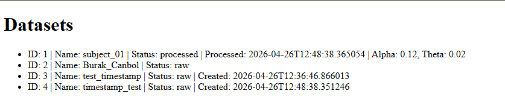

# Backend Project

A lightweight backend system for managing datasets and executing processing pipelines, inspired by real-world data platforms used in research and analytics.

## 🚀 Features

- Create and retrieve datasets
- Run processing pipelines per dataset
- Prevent duplicate processing (state validation)
- Role-based access control (admin, researcher, student)
- Structured event logging
- Timestamp tracking (`created_at`, `processed_at`)
- Persistent storage using Docker bind mounts
- Simple web UI for visualization

## 🧱 Tech Stack

- Python (Flask)
- Docker
- JSON-based storage
- Vanilla JavaScript (UI)

## 📡 API Endpoints

### Datasets
- `GET /datasets` → List all datasets  
- `GET /datasets/<id>` → Retrieve dataset by ID  
- `POST /datasets` → Create a new dataset  

### Pipeline
- `POST /pipeline/run/<id>` → Run processing pipeline  

## 🖥️ Web UI

Access the UI at:
http://localhost:5000/ui


Displays:
- dataset list
- status (raw / processed)
- timestamps
- computed results

## 🧪 Example Usage

### Create dataset
```bash
curl -X POST http://localhost:5000/datasets \
-H "Content-Type: application/json" \
-H "Role: admin" \
-d '{"name": "subject_01"}'
```


### Run pipeline
```bash
curl -X POST http://localhost:5000/pipeline/run/1 \
-H "Role: admin"
```

### Run with Docker
```bash
docker build -t eeg-app .
docker run -p 5000:5000 -v "$(pwd)/data:/app/data" eeg-app
```

## 📸 Screenshot




## 👤 Author

Burak Canbol  
GitHub: https://github.com/BurakCanbol-Personal